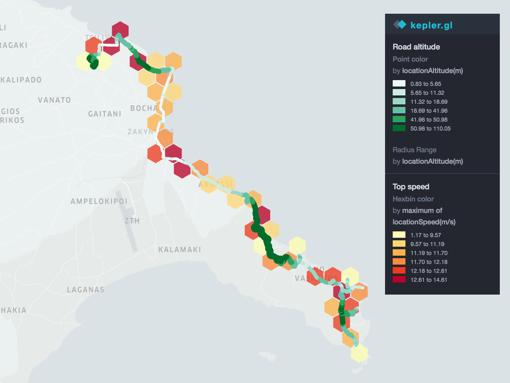

## It's piscab!

Things you can quickly try yourself, with little effort.  

---

## July, 2018 - Deep learning summer school (Genova) 
  
More than 1,000 people went there to follow 26 professors at the [2nd International Summer School on Deep Learning](http://grammars.grlmc.com/DeepLearn2018/). You know always a new speaker will come along and truly dazzle me with their intelligence and knowledge. The week was, [in the end](https://github.com/piscab/piscab.github.io/blob/master/2018_07_Genova/_DL2018.pdf), just awesome!  
        
_How to get there:_ 
* To understand DL, many way are possible. Genova was just a stop in the path. 
* My previous route is available [here](2018_07_Genova/AccompList.md). 

What's your current way to grab DL?

---

## July, 2018 - Map your ride (Zakynthos)  

This picture displays some data collected while riding a scooter from Gerakas beach to the top of a hill near Tsilivi.   
The map shows the average altitude of the road (meters) as well the top speed of the scooter (m/s).  

  

_How to do it:_ 
* I used the [SensorLog](https://itunes.apple.com/us/app/sensorlog/id388014573?mt=8) app for iPhone
* Before starting your ride, activate the log feature (that makes a rich .csv file)
* Once stopped, transfer the log file(s) from the iPhone to a Mac (via iTunes)
* Then, upload the .csv file to the Uber Engineering's [Kepler.gl](https://uber.github.io/kepler.gl) demo application 

Have fun to play with!  

---
