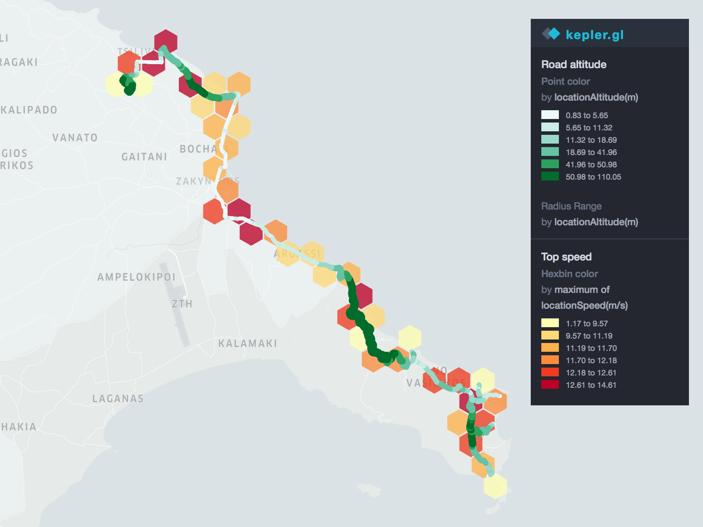

## It's piscab!

Things you can quickly try yourself, with little effort.  

---

## July, 2018 - Zakynthos  

This picture displays some data collected while riding a scooter from Gerakas beach to the top of a hill near Tsilivi.   
The map shows the average altitude of the road (meters) as well the top speed of the scooter (m/s).  

  

_How to do it:_ 
* I used the [SensorLog](https://itunes.apple.com/us/app/sensorlog/id388014573?mt=8) app for iPhone
* Before starting your ride, activate the log feature (that makes a rich .csv file)
* Once stopped, transfer the log file(s) from the iPhone to a Mac (via iTunes)
* Then, upload the .csv file to the Uber Engineering's [Kepler.gl](https://uber.github.io/kepler.gl) demo application 

Have fun to play with!  

---
